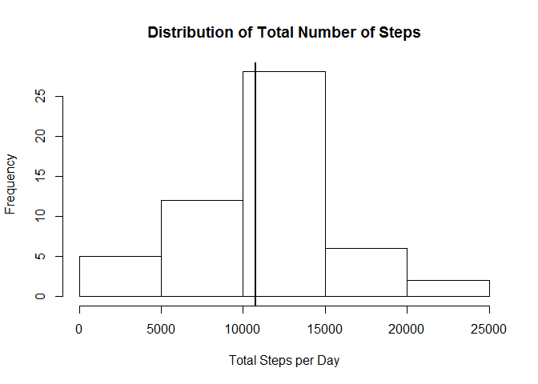
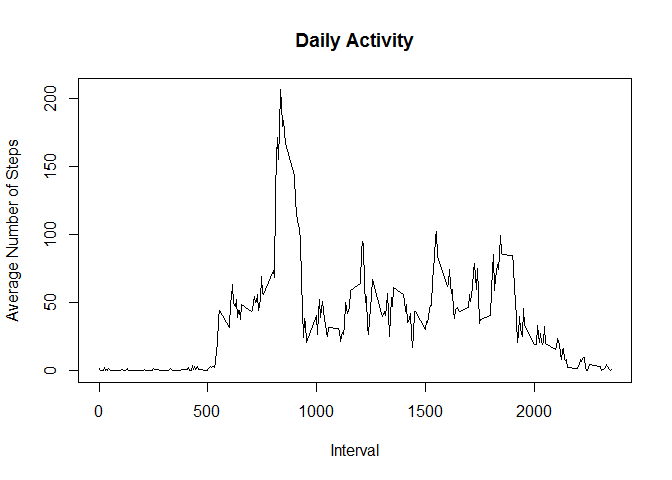
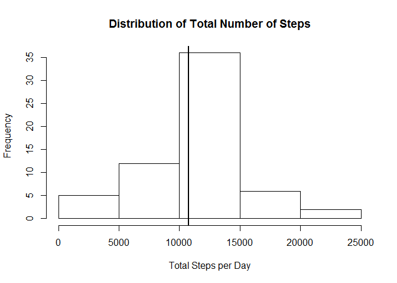
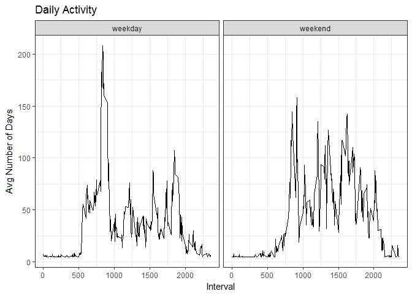

# Reproducible Research: Peer Assessment 1


## Loading and preprocessing the data

First of all, we extract the content of the zip file to the same folder where it is placed. Then we load the resultign csv into R:

```r
unzip("activity.zip")
d <- read.csv("activity.csv")
str(d)
```

```
## 'data.frame':	17568 obs. of  3 variables:
##  $ steps   : int  NA NA NA NA NA NA NA NA NA NA ...
##  $ date    : Factor w/ 61 levels "2012-10-01","2012-10-02",..: 1 1 1 1 1 1 1 1 1 1 ...
##  $ interval: int  0 5 10 15 20 25 30 35 40 45 ...
```

It seems that the data is already in a suitable format for analysis

## What is mean total number of steps taken per day?

To this end, we aggregate the data by date and plot an histogram of the total number of step

```r
library(dplyr)
```

```
## Warning: package 'dplyr' was built under R version 3.3.3
```

```
## 
## Attaching package: 'dplyr'
```

```
## The following objects are masked from 'package:stats':
## 
##     filter, lag
```

```
## The following objects are masked from 'package:base':
## 
##     intersect, setdiff, setequal, union
```

```r
data_bydate <- group_by(d, date)
totalSteps <- summarize(data_bydate, totalSteps = sum(steps))

hist(totalSteps$totalSteps, main = "Distribution of Total Number of Steps", xlab = "Total Steps per Day")
abline(v = mean(totalSteps$totalSteps, na.rm = TRUE),lwd = 2)
abline(v = median(totalSteps$totalSteps, na.rm = TRUE), lwd = 2)
```

<!-- -->

The mean and the median for this distribution are as following:

```r
cat("Mean: ", mean(totalSteps$totalSteps, na.rm = TRUE))
```

```
## Mean:  10766.19
```

```r
cat("Median: ", median(totalSteps$totalSteps, na.rm = TRUE))
```

```
## Median:  10765
```

As you can see, they are pretty close to each other so it is difficult to tell them apart in the previous graph

## What is the average daily activity pattern?

To show this pattern, we first aggregate the data by interval and then we average the number of steps by day over them. Then we make a line graph showing the average number of steps across all the days in the dataset over the intervals

```r
data_byinterval <- group_by(d, interval)
avgPerInterval <- summarize(data_byinterval, avg = mean(steps, na.rm = TRUE))
plot(avgPerInterval$interval, avgPerInterval$avg, type = "l", main = "Daily Activity", ylab = "Average Number of Steps", xlab = "Interval")
```

<!-- -->

The interval with the maxumim number of steps taken is:

```r
avgPerInterval$interval[which.max(avgPerInterval$avg)]
```

```
## [1] 835
```

## Imputing missing values

For the previous calculations, we didn't have in account the fact that there are several NA values across the dataset. 

```r
NAs <- sum(is.na(d$steps))
```

As you can see, the total number of rows with missing values is 2304.
To deal with this problem, we are going to take a really simple approach; this is to replace any NA value by the mean value for steps over all the dataset, which is 37.3825996

We proceed to fill the NAs values in a copy of the original dataset called dfilled

```r
dfilled <- d
dfilled$steps <- ifelse(is.na(d$steps), mean(d$steps, na.rm = TRUE), d$steps)
```


```r
NAsfilled <- sum(is.na(dfilled$steps))
```

As you can see, the total number of rows with missing values for this dfilled dataset is 0.

Now, we show the histogram and calculate the mean and median as we did before
To this end, we aggregate the data by date and plot an histogram of the total number of step

```r
library(dplyr)
data_bydate <- group_by(dfilled, date)
totalSteps <- summarize(data_bydate, totalSteps = sum(steps))

hist(totalSteps$totalSteps, main = "Distribution of Total Number of Steps", xlab = "Total Steps per Day")
abline(v = mean(totalSteps$totalSteps, na.rm = TRUE),lwd = 2)
abline(v = median(totalSteps$totalSteps, na.rm = TRUE), lwd = 2)
```

<!-- -->

The mean and the median for this distribution are as following:

```r
cat("Mean: ", mean(totalSteps$totalSteps, na.rm = TRUE))
```

```
## Mean:  10766.19
```

```r
cat("Median: ", median(totalSteps$totalSteps, na.rm = TRUE))
```

```
## Median:  10766.19
```

Now the median and the mean are exactly the same. Overall we can conclude that the influence of the NAs in our dataset was negligible, even when they represent 13.1147541% of the total observations from the original dataset.


## Are there differences in activity patterns between weekdays and weekends?
From now on we will use the filled dataset.

To this end, we first create a categorizing variable that will tell us if a certain day is a weekday or belongs to a weekend.

```r
dfilled <- mutate(dfilled, kindofday = factor(1 * (weekdays(as.Date(d$date)) %in% c("Saturday", "Sunday")), labels = c("weekday", "weekend")))
```

```
## Warning: package 'bindrcpp' was built under R version 3.3.3
```

Now we create a plot with the daily activity but this time splitted by type of day

```r
library(ggplot2)
```

```
## Warning: package 'ggplot2' was built under R version 3.3.3
```

```r
data_byinterval_bykindofday <- group_by(dfilled, interval, kindofday)
avgPerInterval <- summarize(data_byinterval_bykindofday, avg = mean(steps, na.rm = TRUE))

g <- ggplot(avgPerInterval, aes(interval, avg))

g + geom_line() + 
    labs(title = "Daily Activity") +
    labs(x = "Interval", y = "Avg Number of Days") +
    facet_grid(. ~ kindofday) +
    theme_bw()
```

<!-- -->


